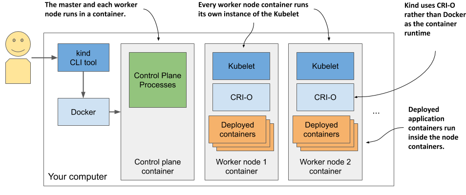

## Deploy EKS clusters with Kind<a name="lab-01---deploy-eks-clusters-"></a>



* Deploy the first cluster

```shell
kind-cluster1.yaml:
-------------------

kind: Cluster
apiVersion: kind.x-k8s.io/v1alpha4
name: management
nodes:

- role: control-plane
- role: worker
- role: worker

networking:
disableDefaultCNI: true
podSubnet: "10.0.0.0/16"
serviceSubnet: "10.1.0.0/16" 

```

* Deploy the second cluster

```shell
kind-cluster2.yaml:
-------------------

kind: Cluster
apiVersion: kind.x-k8s.io/v1alpha4
name: lob
nodes:

- role: control-plane
- role: worker
- role: worker
- role: worker
  networking:
  disableDefaultCNI: true
  podSubnet: "10.2.0.0/16"
  serviceSubnet: "10.3.0.0/16"
```

* Run in the command line

```shell
 Note:  kind create cluster --name vamshi --config kind-cluster1.yaml --image kindest/node:v1.28.0@sha256:b7a4cad12c197af3ba43202d3efe03246b3f0793f162afb40a33c923952d5b31
kind create cluster --name=cluster1 --config=kind-cluster1.yaml --retain -v 1
kind create cluster --name=cluster2 --config=kind-cluster2.yaml --retain -v 1
```
