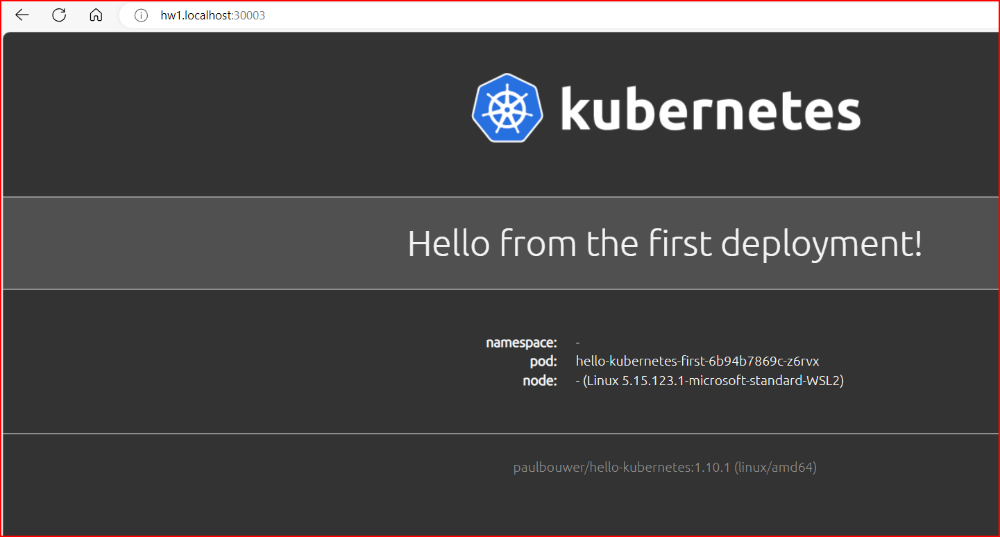
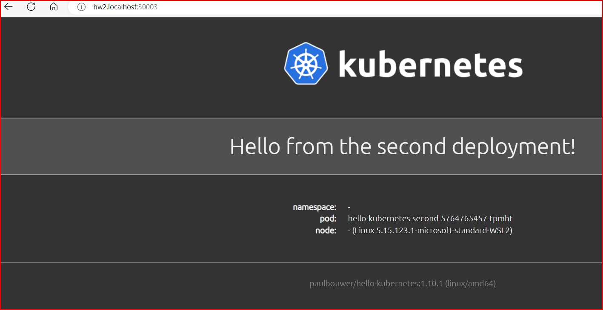

## Kuberenetes LoadBalancer<a name="lab-01---deploy-eks-clusters-"></a>


* Deploy Kubernetes Loadbalancer on EKS Cluster

```shell
hello-kubernetes-first.yaml
---------------------------
apiVersion: v1
kind: Service
metadata:
  name: hello-kubernetes-first
spec:
  type: ClusterIP
  ports:
  - port: 80
    targetPort: 8080
  selector:
    app: hello-kubernetes-first
---
apiVersion: apps/v1
kind: Deployment
metadata:
  name: hello-kubernetes-first
spec:
  replicas: 3
  selector:
    matchLabels:
      app: hello-kubernetes-first
  template:
    metadata:
      labels:
        app: hello-kubernetes-first
    spec:
      containers:
      - name: hello-kubernetes
        image: paulbouwer/hello-kubernetes:1.10
        ports:
        - containerPort: 8080
        env:
        - name: MESSAGE
          value: Hello from the first deployment!


          $ kubectl apply -f hello-kubernetes-first.yaml 
            service/hello-kubernetes-first created
            deployment.apps/hello-kubernetes-first created

         $ kubectl get service hello-kubernetes-first
NAME                     TYPE        CLUSTER-IP    EXTERNAL-IP   PORT(S)   AGE
hello-kubernetes-first   ClusterIP   10.96.94.27   <none>        80/TCP    71s

```

```shell

nano hello-kubernetes-second.yaml
---------------------------------
apiVersion: v1
kind: Service
metadata:
  name: hello-kubernetes-second
spec:
  type: ClusterIP
  ports:
  - port: 80
    targetPort: 8080
  selector:
    app: hello-kubernetes-second
---
apiVersion: apps/v1
kind: Deployment
metadata:
  name: hello-kubernetes-second
spec:
  replicas: 3
  selector:
    matchLabels:
      app: hello-kubernetes-second
  template:
    metadata:
      labels:
        app: hello-kubernetes-second
    spec:
      containers:
      - name: hello-kubernetes
        image: paulbouwer/hello-kubernetes:1.10
        ports:
        - containerPort: 8080
        env:
        - name: MESSAGE
          value: Hello from the second deployment!


          $ kubectl create -f hello-kubernetes-second.yaml
service/hello-kubernetes-second created
deployment.apps/hello-kubernetes-second created


$ kubectl get service
NAME                        TYPE        CLUSTER-IP      EXTERNAL-IP   PORT(S)                        AGE
hello-kubernetes-first      ClusterIP   10.96.94.27     <none>        80/TCP                         2m55s
hello-kubernetes-second     ClusterIP   10.96.142.224   <none>        80/TCP                         22s

```

* Install Kubernetes Ingress Controller

```shell

$ helm repo add ingress-nginx https://kubernetes.github.io/ingress-nginx
"ingress-nginx" already exists with the same configuration, skipping

$ helm repo  update
Hang tight while we grab the latest from your chart repositories...
...Successfully got an update from the "metallb" chart repository
...Successfully got an update from the "kubernetes-dashboard" chart repository
...Successfully got an update from the "ingress-nginx" chart repository
...Successfully got an update from the "gloo-platform" chart repository
...Successfully got an update from the "eks" chart repository
...Successfully got an update from the "nginx-stable" chart repository
...Successfully got an update from the "devtron" chart repository
...Successfully got an update from the "cilium" chart repository
...Successfully got an update from the "grafana" chart repository
Update Complete. ⎈Happy Helming!⎈

$  helm install nginx-ingress ingress-nginx/ingress-nginx --set controller.publishService.enabled=true
NAME: nginx-ingress
LAST DEPLOYED: Sun Oct  8 17:51:19 2023
NAMESPACE: default
STATUS: deployed
REVISION: 1
TEST SUITE: None


$ kubectl --namespace default get services -o wide -w nginx-ingress-ingress-nginx-controller
NAME                                     TYPE           CLUSTER-IP      EXTERNAL-IP   PORT(S)                      AGE   SELECTOR
nginx-ingress-ingress-nginx-controller   LoadBalancer   10.96.106.241   <pending>     80:31237/TCP,443:32486/TCP   31s   app.kubernetes.io/component=controller,app.kubernetes.io/instance=nginx-ingress,app.kubernetes.io/name=ingress-nginx

$ kubectl port-forward svc/nginx-ingress-ingress-nginx-controller 30003:80 --address 0.0.0.0
Forwarding from 0.0.0.0:30003 -> 80
Handling connection for 30003
Handling connection for 30003
Handling connection for 30003

```
* Create Ingress : exposing apps using ingress

```shell
hello-kubernetes-ingress.yaml
=============================

apiVersion: networking.k8s.io/v1
kind: Ingress
metadata:
  name: hello-kubernetes-ingress
  annotations:
    kubernetes.io/ingress.class: nginx
spec:
  rules:
  - host: "localhost"
    http:
      paths:
      - pathType: Prefix
        path: "/"
        backend:
          service:
            name: hello-kubernetes-first
            port:
              number: 80
  - host: "localhost"
    http:
      paths:
      - pathType: Prefix
        path: "/"
        backend:
          service:
            name: hello-kubernetes-second
            port:
              number: 80

$ kubectl apply -f hello-kubernetes-ingress.yaml 
Warning: annotation "kubernetes.io/ingress.class" is deprecated, please use 'spec.ingressClassName' instead
ingress.networking.k8s.io/hello-kubernetes-ingress created


hosts file
==========

# To allow the same kube context to work on the host and the container:
127.0.0.1 kubernetes.docker.internal hw1.localhost hw2.localhost


```







* Secure Ingress with Cert manager

```shell

$ kubectl create namespace cert-manager
namespace/cert-manager created

$ helm repo add jetstack https://charts.jetstack.io
"jetstack" has been added to your repositories


$ helm repo update
Hang tight while we grab the latest from your chart repositories...
...Successfully got an update from the "gloo-platform" chart repository
...Successfully got an update from the "devtron" chart repository
...Successfully got an update from the "nginx-stable" chart repository
...Successfully got an update from the "kubernetes-dashboard" chart repository
...Successfully got an update from the "ingress-nginx" chart repository
...Successfully got an update from the "metallb" chart repository
...Successfully got an update from the "jetstack" chart repository
...Successfully got an update from the "eks" chart repository
...Successfully got an update from the "cilium" chart repository
...Successfully got an update from the "grafana" chart repository
Update Complete. ⎈Happy Helming!⎈


helm install cert-manager jetstack/cert-manager --namespace cert-manager --version v1.13.1 --set installCRDs=true
NAME: cert-manager
LAST DEPLOYED: Sun Oct  8 18:37:35 2023
NAMESPACE: cert-manager
STATUS: deployed
REVISION: 1
TEST SUITE: None
NOTES:
cert-manager v1.13.1 has been deployed successfully!

In order to begin issuing certificates, you will need to set up a ClusterIssuer
or Issuer resource (for example, by creating a 'letsencrypt-staging' issuer).

More information on the different types of issuers and how to configure them
can be found in our documentation:

https://cert-manager.io/docs/configuration/

For information on how to configure cert-manager to automatically provision
Certificates for Ingress resources, take a look at the `ingress-shim`
documentation:

https://cert-manager.io/docs/usage/ingress/


$ kubectl apply -f production-issuer.yaml 
clusterissuer.cert-manager.io/letsencrypt-prod created


```

```shell
Append the  hello-kubernetes-ingress.yaml

annotations:
  kubernetes.io/ingress.class: nginx
  cert-manager.io/cluster-issuer: letsencrypt-prod
spec:
  tls:
  - hosts:
    - hw1.localhost
    - hw2.localhost
    secretName: hello-kubernetes-tls


    $ kubectl apply -f hello-kubernetes-ingress.yaml 
ingress.networking.k8s.io/hello-kubernetes-ingress configured

```

