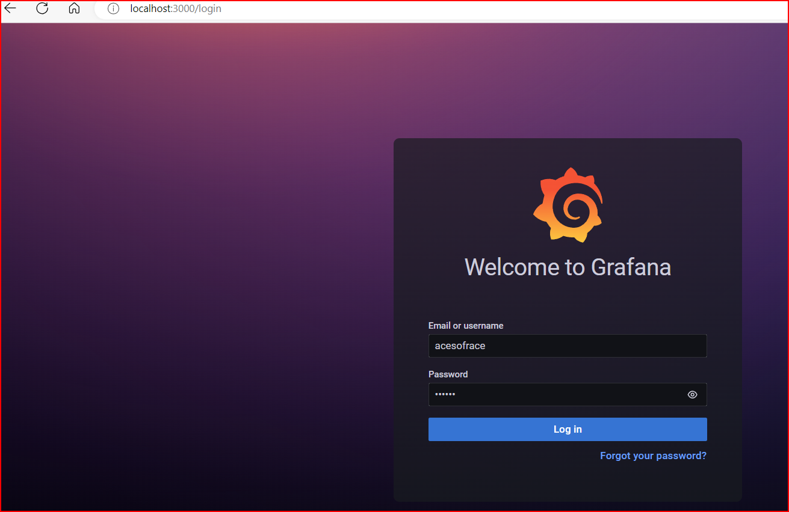
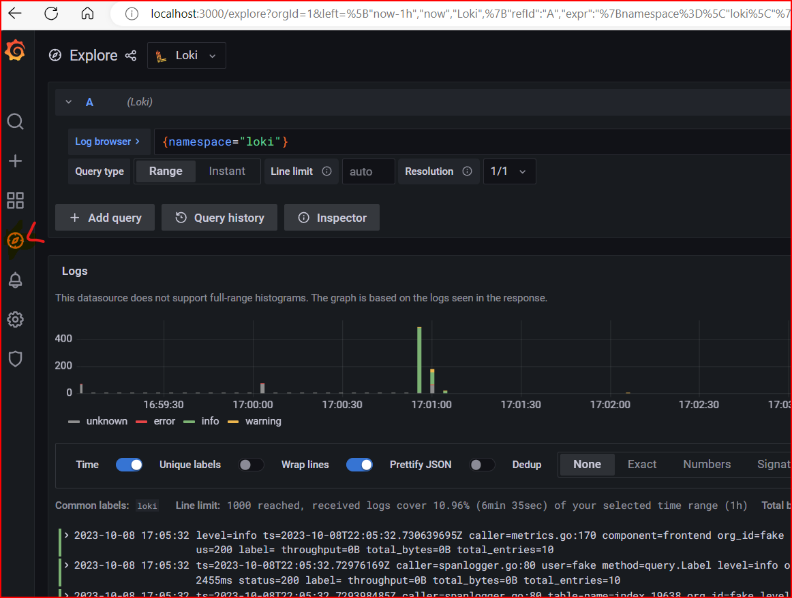

## Kuberenetes Logging - Loki/Grafana <a name="lab-01---deploy-eks-clusters-"></a>

* Deploy Kubernetes Dashboard on EKS Cluster

```shell
kind: Cluster
apiVersion: kind.x-k8s.io/v1alpha4
name: kubernetes-tools
nodes:
- role: control-plane
- role: worker
 
```

```shell
helm repo add grafana https://grafana.github.io/helm-charts
helm upgrade --install promtail grafana/promtail
helm repo update

 helm upgrade --install loki grafana/loki -n loki
Release "loki" has been upgraded. Happy Helming!
NAME: loki
LAST DEPLOYED: Sun Oct  8 16:56:28 2023
NAMESPACE: loki
STATUS: deployed
REVISION: 2
NOTES:
***********************************************************************
 Welcome to Grafana Loki
 Chart version: 5.26.0
 Loki version: 2.9.1
***********************************************************************

Installed components:
* grafana-agent-operator
* gateway
* read
* write
* backend

$ helm install loki grafana/loki-stack --namespace loki --create-namespace --set grafana.enabled=true
NAME: loki
LAST DEPLOYED: Sun Oct  8 16:48:07 2023
NAMESPACE: loki
STATUS: deployed
REVISION: 1
NOTES:
The Loki stack has been deployed to your cluster. Loki can now be added as a datasource in Grafana.

See http://docs.grafana.org/features/datasources/loki/ for more detail.

msh@Predator MINGW64 ~
$ helm upgrade loki grafana/loki-stack --namespace loki --create-namespace --set grafana.enabled=true
Release "loki" has been upgraded. Happy Helming!
NAME: loki
LAST DEPLOYED: Sun Oct  8 17:00:56 2023
NAMESPACE: loki
STATUS: deployed
REVISION: 3
NOTES:
The Loki stack has been deployed to your cluster. Loki can now be added as a datasource in Grafana.

See http://docs.grafana.org/features/datasources/loki/ for more detail.

$kubectl get secret --namespace loki loki-grafana -o jsonpath="{.data.admin-password}" | base64 --decode ; echo
AHaLxYMosMjto7bZ4F9dEt0YvzqFhUp8NtWMHaz6


vamsh@Predator MINGW64 /e/Projects/kubernetes-mesh/Kubernetes-Dashboard (main)
$ kubectl port-forward --namespace loki service/loki-grafana 3000:80
Forwarding from 127.0.0.1:3000 -> 3000
Forwarding from [::1]:3000 -> 3000
Handling connection for 3000
Handling connection for 3000
Handling connection for 3000
Handling connection for 3000
Handling connection for 3000
Handling connection for 3000

```



```shell
{namespace="loki"}
```



```shell
for Docker compose

version: "3"

networks:
  loki:

services:
  loki:
    image: grafana/loki:2.3.0
    ports:
      - "3100:3100"
    command: -config.file=/etc/loki/local-config.yaml
    networks:
      - loki

  promtail:
    image: grafana/promtail:2.3.0
    volumes:
      - /var/log:/var/log
    command: -config.file=/etc/promtail/config.yml
    networks:
      - loki

  grafana:
    image: grafana/grafana:latest
    ports:
      - "3000:3000"
    networks:
      - loki


      docker-compose up
```


* References
  * [Deploy Loki on Kubernetes, and monitor the logs of your pods | cylab.be](https://cylab.be/blog/197/deploy-loki-on-kubernetes-and-monitor-the-logs-of-your-pods)
